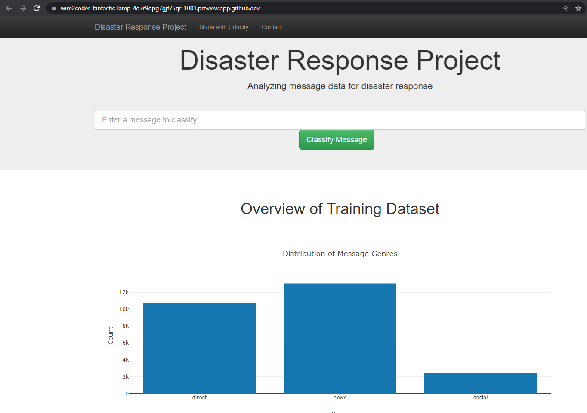
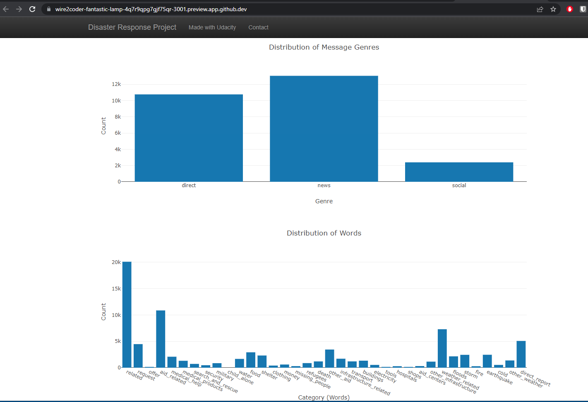
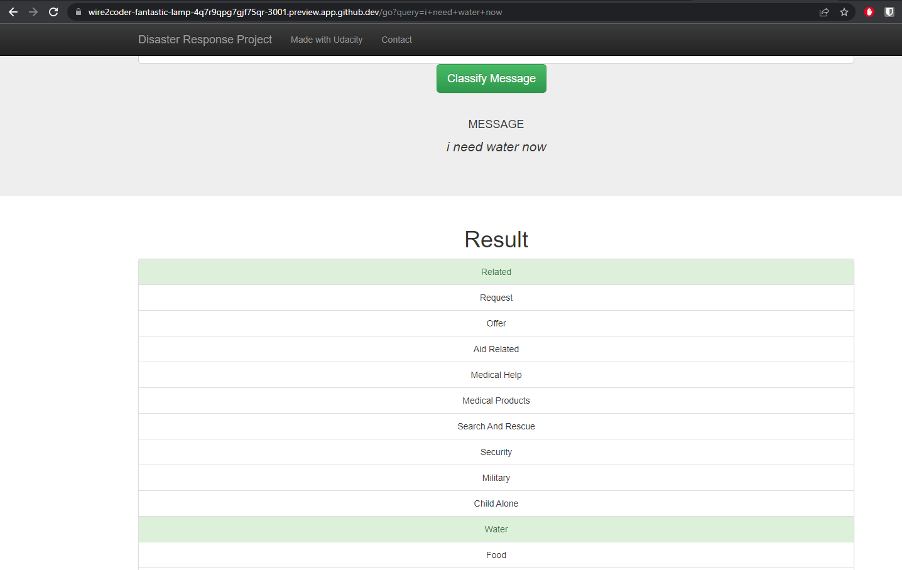
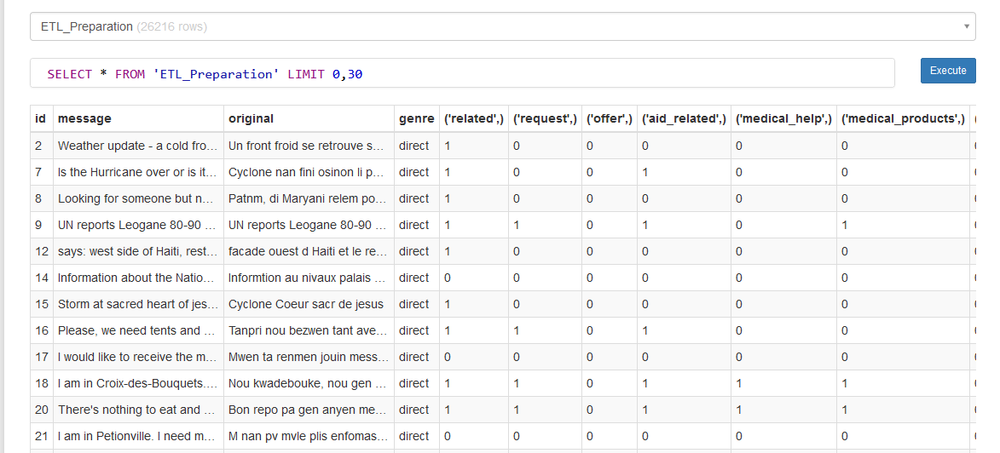

## Table of Contents
- [Summary](#summary)
- [Description](#description)
- [Metrics for Results](#metrics)
- [Getting Started](#getting-started)
- [Dependencies](#dependencies)
- [Installing](#installing)
- [Executing Program](#executing-program)
- [Screenshots](#screenshots)

## Summary
here1, 0713_Thu_15June2023

## Description
The objective is to construct a Natural Language Processing (NLP) model capable of categorizing messages from real-life disaster events. The dataset consists of pre-labeled tweets and messages. The project is divided into three main sections. 

    Data processing:
        Develop an ETL pipeline to extract data from the source
        Clean the data
        Save the cleaned data in a SQLite database

    Machine learning pipeline:
        Build a machine learning pipeline
        Train the model to classify text messages into various categories

    Web application:
        Run a web application to display the results of the model in real-time.

## Metrics for Results

1. **Precision**: If your model predicts a message as 'related', precision tells you how likely it is that the message is indeed 'related'. High precision is good.

2. **Recall**: Out of all the 'related' messages, recall tells you how many of them your model was able to find. High recall is good.

3. **F1-Score**: This is a combination of precision and recall into a single number. It tries to give you a single score to evaluate your model instead of having to look at two different ones (precision and recall). Again, a high F1 score is good.

4. **Support**: This tells you how many examples of each class you had in the data you used to evaluate the model.


## Getting Started
1. run Piplines/ETL Pipeline Preparation.ipynb and will make ETL_Preparation.db file
2. run Piplines/ML Pipeline Preparation.ipynb and will make mo2.pkl file
3. in data/process_data.py is doing the samething as ETL Pipeline Preparation.ipynb, creates the ETL_Preparation.db file
4. in models/train_classifier.py is doing the samething as ML Pipeline Preparation.ipynb, it creates mo2.pkl file

## Dependencies

requirements.txt

- numpy
- pandas
- sqlalchemy<2.0
- NLTK
- scikit-learn
- plotly
- Flask

## Installing

```
python -m venv myenv

# for windows
myenv\Scripts\activate.bat

# for linux and macOS
source myenv/bin/activate

pip install -r requirements.txt
```

## Executing Program

- go back to the 'root location' before running the command below
- 'root location' is disaster-response-pipeline-uda

Making the database file
```
python data/process_data.py data/disaster_messages.csv data/disaster_categories.csv ETL_Preparation.db
```

Making the 'pickle file'
```
python models/train_classifier.py ./ETL_Preparation.db ./mo3.pkl
```

Run the 'Flask application'
```
python app/run.py 
```

Or just one long command (Linux)
```
python data/process_data.py data/disaster_messages.csv data/disaster_categories.csv ETL_Preparation.db && python models/train_classifier.py ./ETL_Preparation.db ./mo3.pkl && python app/run.py 
```

go to http://127.0.0.1:3001/


## Screenshots






